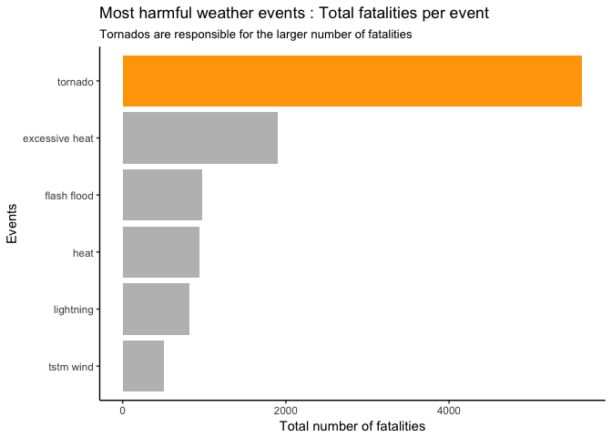
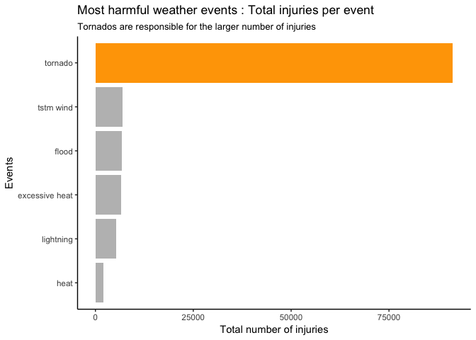
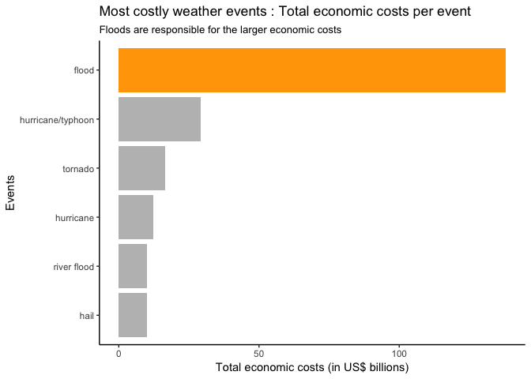

Severe weather events : tornados are the most damaging for the human health and floods are the most costly for the economy
================
Nicolas Corneau-Tremblay
8/3/2017

Synopsis
--------

This report presents an analysis of the human and economic consequences of severe weather events in the United States. It is based on U.S. National Oceanic and Atmospheric Administration's (NOAA) storm database from 1950 to 2011. For each weather event type, total fatalities, total injuries and total economic costs were obtained over the entire period. As results, tornados were found to be responsible for the larger human consequences while floods are responsible for the larger economic costs.

Data processing
---------------

This section presents the data manipulations conducted for the analysis. The analysis are based on U.S. National Oceanic and Atmospheric Administration's (NOAA) storm database. There were conducted using the following packages :

``` r
library(readr)
library(dplyr)
library(ggplot2)
library(scales)
```

The data were stored in a .csv file and were loaded into R such as :

``` r
weather <- read_csv("repdata_data_StormData.csv")

names(weather) <- gsub("_", ".", tolower(names(weather)))

weather <- weather %>%
    mutate(event = tolower(factor(evtype, levels = unique(evtype))))
```

To investigate the impact of severe weather events on human health, the total of fatalities and injuries resulting from each event were taken over the entire period of observation. This statistic was prefered because it captures both the effects of frequency of each event type and the dommage associated with each episode.

``` r
health <- weather %>%
    group_by(event) %>%
    summarise(sum.fatal = sum(fatalities, na.rm = TRUE),
              sum.injur = sum(injuries, na.rm = TRUE),
              count = n())
```

For the economic consequences of severe weather events, the property and crop damages were for converted in US$. The two variables were then summed to obtain the total economic costs resulting from each weather event type. Again, this statistic gives which severe weather event is the most costly for the U.S., regarless of it frequency.

``` r
weather <- weather %>%
    mutate(costs.prop = ifelse(grepl("[Hh]", propdmgexp), propdmg*100,
                             ifelse(grepl("[Kk]", propdmgexp), propdmg*1000,
                                    ifelse(grepl("[Mm]", propdmgexp), propdmg*1000000,
                                           ifelse(grepl("[Bb]", propdmgexp),
                                                  propdmg*1000000000, NA)))),
           costs.crop = ifelse(grepl("[Hh]", cropdmgexp), cropdmg*100,
                             ifelse(grepl("[Kk]", cropdmgexp), cropdmg*1000,
                                    ifelse(grepl("[Mm]", cropdmgexp), cropdmg*1000000,
                                           ifelse(grepl("[Bb]", cropdmgexp),
                                                  cropdmg*1000000000, NA)))),
           eco.costs = (costs.prop + costs.crop)/1000000000)


economic <- weather %>%
    group_by(event) %>%
    summarise(sum.costs = sum(eco.costs, na.rm = TRUE),
              count = n())
```

Results
-------

The main results of this report are presented in this section.

For the human consequences, tornados turned out to be responsible both for the larger number of fatalities and the larger number of injuries, as it is possible to see in the following barplots.

``` r
health %>%
    arrange(desc(sum.fatal)) %>%
    head(., 6) %>%
    ggplot(.) +
    geom_col(aes(reorder(event, (sum.fatal)), sum.fatal),
             fill = c("grey", "grey", "grey", "grey", "grey", "orange")) +
    theme_classic() +
    labs(title = "Most harmful weather events : Total fatalities per event",
         subtitle = "Tornados are responsible for the larger number of fatalities",
         x = "Events",
         y = "Total number of fatalities") +
    coord_flip()
```



``` r
health %>%
    arrange(desc(sum.injur)) %>%
    head(., 6) %>%
    ggplot(.) +
    geom_col(aes(reorder(event, (sum.injur)), sum.injur),
             fill = c("grey", "grey", "grey", "grey", "grey", "orange")) +
    theme_classic() +
    labs(title = "Most harmful weather events : Total injuries per event",
         subtitle = "Tornados are responsible for the larger number of injuries",
         x = "Events",
         y = "Total number of injuries") +
    coord_flip()
```



For the economic consequences, floods were responsible for the larger economic costs (property and crop), as it is displayed in the following barplot.

``` r
economic %>%
    arrange(desc(sum.costs)) %>%
    head(., 6) %>%
    ggplot(.) +
    geom_col(aes(reorder(event, (sum.costs)), sum.costs),
             fill = c("grey", "grey", "grey", "grey", "grey", "orange")) +
    theme_classic() +
    labs(title = "Most costly weather events : Total economic costs per event",
         subtitle = "Floods are responsible for the larger economic costs",
         x = "Events",
         y = "Total economic costs (in US$ billions)") +
    scale_y_continuous(labels = comma) +
    coord_flip()
```


